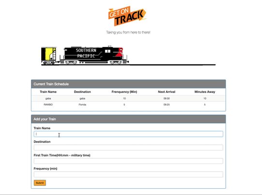

## Train Track - A web based Destination app that uses CRUD.  

A Web based Javascript/ HTML5 application that uses the CRUD method to which lets users input destinations of choice which calculates times until the next train arrives.

## Live Demo

[See Train Track Live](https://ramirolpz55.github.io/TrainTrack/)

## Usage

1. Clone repo
2. npm install
3. cd TrainTrack			
4. open index.html in any browser
5. Input the required fields/ submit with the destinations of your choice and see your own train schedule apprear before your eyes.  
6. ENJOY! 

## Contributing

1. Fork it!
2. Create your feature branch: `git checkout -b my-new-feature`
3. Commit your changes: `git commit -am 'Add some feature'`
4. Push to the branch: `git push origin my-new-feature`
5. Submit a pull request :D

## Tech Used 

* JAVASCRIPT 
* HTML5 
* CSS 
* CSS
* Ajax
* Firebase
* Moment.js (Full featured date library for parsing, validating, manipulating, and formatting dates.)

## License

N/A